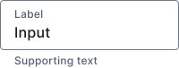

# Mobi Lab Components for Compose

Mobi Lab Components for Compose (`LabComponentsCompose`) help developers execute our internal design system's components on the Android platform.

Maven Central artifact available from https://central.sonatype.com/search?q=mobi.lab.labcomponents:labcomponents-compose

```groovy
implementation 'mobi.lab.labcomponents:labcomponents-compose:0.0.3' // Check the latest version from Maven Central
```

The components provide implementations for [Mobi Lab's design system](https://www.figma.com/file/gxt4iyWGyliILJSOCLXonl/P42-design-system-template?type=design&node-id=1652-14713&mode=design&t=j4TbnOpahS3korsT-0).

These components are based on [Material Components for Android](https://github.com/material-components/material-components-android).

## Compatible versions

| Lab Components for Compose version | Compose BOM version used | CompileSdk used     |
| ---------------------------------- | :----------------------- | ------------------- |
| 0.0.3                              | 2025.04.01               | API 35 / Android 15 |
| 0.0.2                              | 2025.04.01               | API 35 / Android 15 |
| 0.0.1                              | 2025.04.01               | API 35 / Android 15 |

## Description

The library contains a ready-to-use Compose implementation of the components from Mobi Lab's design system. Mobi Lab's design system allows teams to focus on solving business problems instead of reinventing basic design system and UI components at the design and implementation phases.

The project consists of the component library in `lib` module and the components demo application in `app-demo` module.

## Buttons

Supported:

- Filled button
  

  ```kotlin
  // Medium
  LabFilledButton(
      text = "Click Me!",
      onClick = {},
      enabled = enabled.value
  )
  ```

  ```kotlin
  // Small
  LabFilledSmallButton(
      text = "Click Me!",
      onClick = {},
  )
  ```

- Toned button
  

  ```kotlin
  // Medium
  LabTonedButton(
      text = "Click Me!",
      onClick = {},
  )
  ```

  ```kotlin
  // Small
  LabTonedSmallButton(
      text = "Click Me!",
      onClick = {},
  )
  ```

- Outlined button
  

  ```kotlin
  // Medium
  LabOutlinedButton(
      text = "Click Me!",
      onClick = {},
  )
  ```

  ```kotlin
  // Small
  LabOutlinedSmallButton(
      text = text = "Click Me!",
      onClick = {},
  )
  ```

- Text button
  

  ```kotlin
  // Medium
  LabTextButton(
      text = "Click Me!",
      onClick = {},
  )
  ```

  ```kotlin
  // Small
  LabTextSmallButton(
      text = "Click Me!",
      onClick = {},
  )
  ```

- Icon button
  
  
  ```kotlin
  // Medium
  LabIconButton(
      icon = ImageSource.vector(Icons.Filled.FavoriteBorder),
      contentDescription = "Like",
      onClick = {},
  )
  ```
  
  ```kotlin
  // Small
  LabIconSmallButton(
      icon = ImageSource.vector(Icons.Filled.FavoriteBorder),
      contentDescription = "Like",
      onClick = {},
  )
  ```

See 

- usage examples at https://github.com/LabMobi/labcomponents-compose/blob/main/app-demo/src/main/java/mobi/lab/components/compose/demo/button/ButtonDestination.kt
- design at https://www.figma.com/design/gxt4iyWGyliILJSOCLXonl/P42-DDD-design-system-template?node-id=1972-21984&m=dev

## Colors

See 

- usage examples at https://github.com/LabMobi/labcomponents-compose/blob/main/app-demo/src/main/java/mobi/lab/components/compose/demo/color/ColorsDestination.kt
- design at https://www.figma.com/design/gxt4iyWGyliILJSOCLXonl/P42-DDD-design-system-template?node-id=1972-22024&m=dev

## TextFields

- TextField with a label
  

  ```kotlin
  var text1: String by rememberSaveable { mutableStateOf("Input") }
  LabTextField(
      modifier = Modifier.fillMaxWidth(),
      value = text1,
      label = "Label",
      onValueChange = { text1 = it },
      enabled = enabled.value,
      supportingText = "Supporting text",
      errorValue = "",
      errorReserveSpace = true,
      singleLine = true,
  )
  ```

- TextFields for login via email and password

  ```kotlin
  var text2: String by rememberSaveable { mutableStateOf("") }
  LabTextField(
      modifier = Modifier
          .fillMaxWidth()
          .semantics { contentType = ContentType.EmailAddress },
      value = text2,
      onValueChange = { text2 = it },
      label = "Email",
      enabled = enabled.value,
      errorValue = errorText,
      errorReserveSpace = true,
      singleLine = singleLine.value,
  )
  var text3: String by rememberSaveable { mutableStateOf("") }
  var text3ShowPassword by rememberSaveable { mutableStateOf(false) }
  LabTextField(
      modifier = Modifier
          .fillMaxWidth()
          .semantics { contentType = ContentType.Password },
      value = text3,
      onValueChange = { text3 = it },
      label = "Password",
      trailingIcon = ImageSource.vector(Icons.Filled.Info),
      trailingIconContentDescription = "Toggle password visibility",
      onTrailingIconClick = { text3ShowPassword = !text3ShowPassword },
      enabled = enabled.value,
      errorValue = errorText,
      errorReserveSpace = true,
      singleLine = singleLine.value,
      visualTransformation = if (text3ShowPassword) {
          VisualTransformation.None
      } else {
          PasswordVisualTransformation()
      },
      keyboardOptions = KeyboardOptions(keyboardType = KeyboardType.Password)
  )
  ```

See 

- usage examples at https://github.com/LabMobi/labcomponents-compose/tree/main/app-demo/src/main/java/mobi/lab/components/compose/demo/textfield/TextFieldDestination.kt
- design at https://www.figma.com/design/gxt4iyWGyliILJSOCLXonl/P42-DDD-design-system-template?node-id=1971-21101&m=dev

## Typography

See 

- usage examples at https://github.com/LabMobi/labcomponents-compose/blob/main/app-demo/src/main/java/mobi/lab/components/compose/demo/typography/TypographyDestination.kt
- design at https://www.figma.com/design/gxt4iyWGyliILJSOCLXonl/P42-DDD-design-system-template?node-id=1972-21998&m=dev

## Progress indicators

- Indeterminate progress
  
  
  ```kotlin
  LabIndeterminateProgress()
  ```

- Indeterminate progress with a larger size

  ```kotlin
  LabIndeterminateProgress(modifier = Modifier.size(40.dp))
  ```

See 

- usage examples at https://github.com/LabMobi/labcomponents-compose/blob/main/app-demo/src/main/java/mobi/lab/components/compose/demo/progress/ProgressDestination.kt
- design at https://www.figma.com/design/gxt4iyWGyliILJSOCLXonl/P42-DDD-design-system-template?node-id=3680-8065&m=dev

## Links

- [Changelog](CHANGELOG.md)
- [Upcoming tasks](docs/upcoming_tasks.md)
- [Directory Structure](docs/directory_structure.md)
- [Resource Visibility](docs/resource_visibility.md)
- [Contributing](docs/contributing.md)
- [Release Guide](RELEASE_GUIDE.md)
- [Material Components for Android](https://github.com/material-components/material-components-android) (external)

